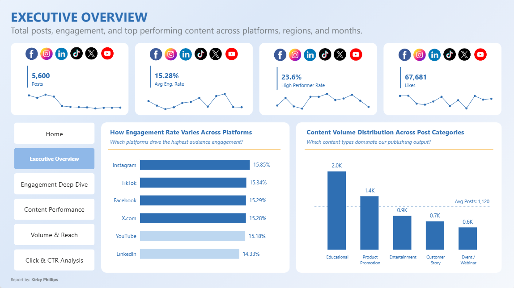
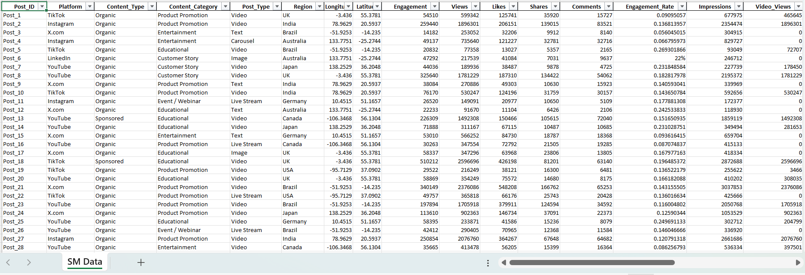
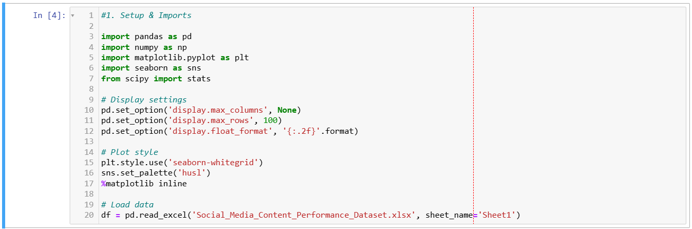
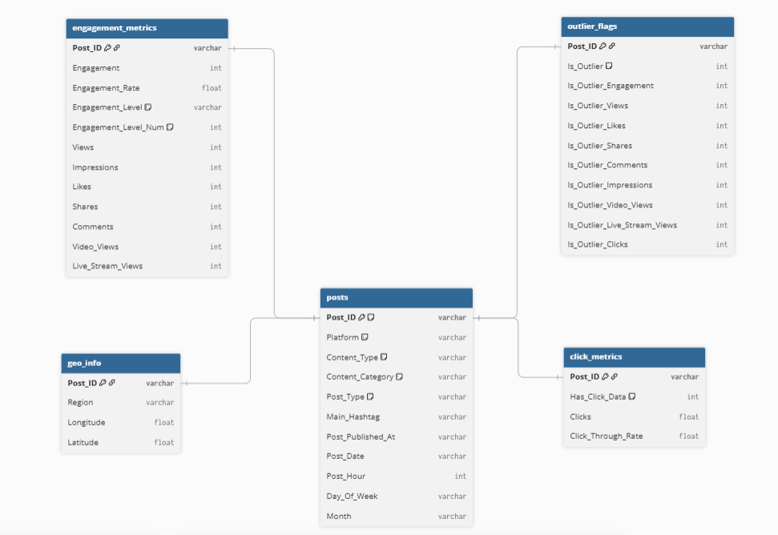
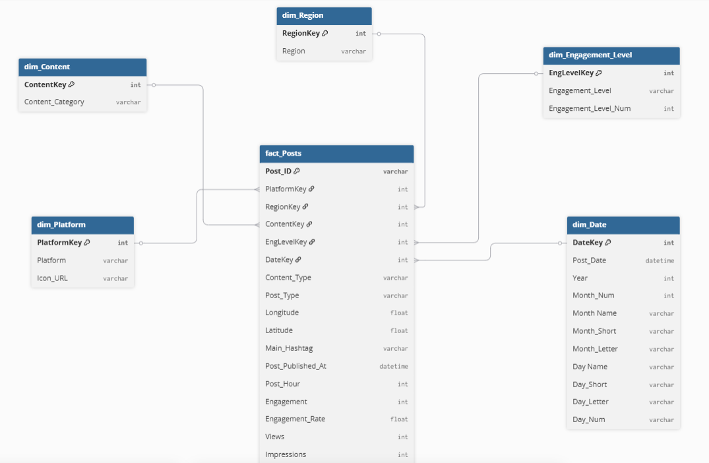
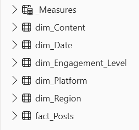
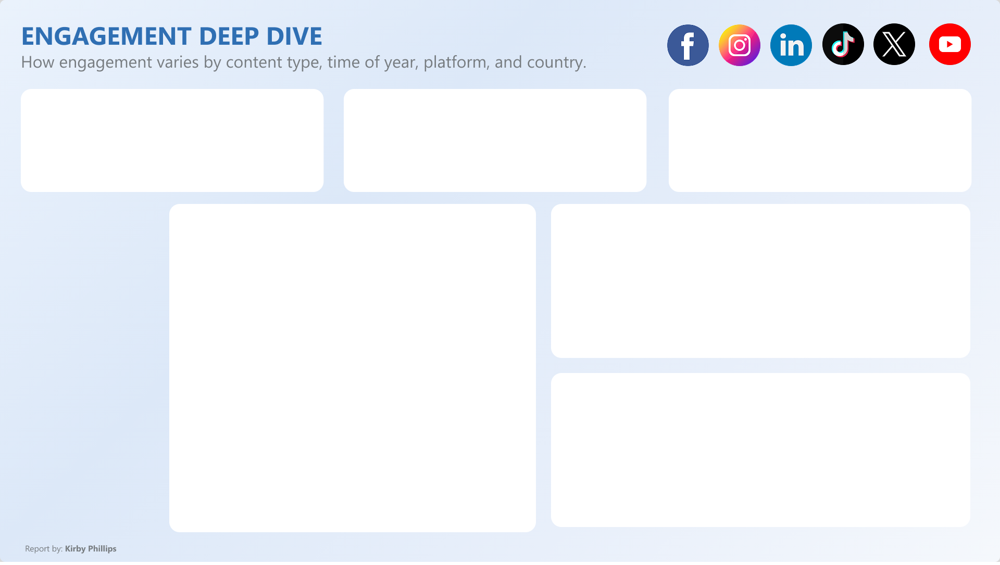
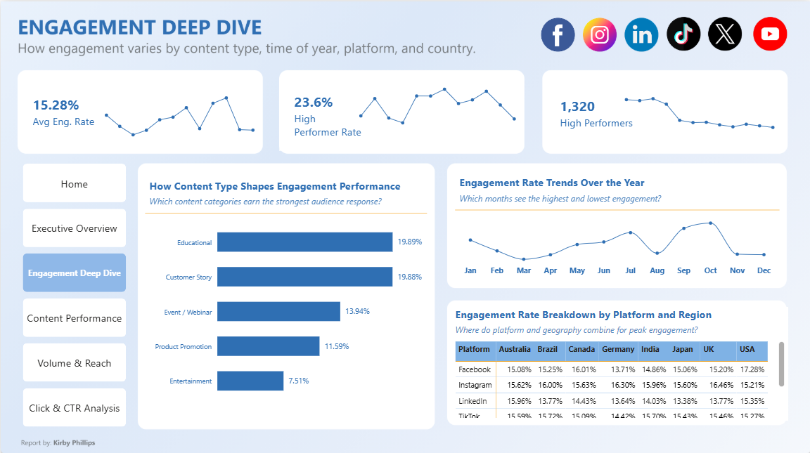

# Automated Social Media Content Performance Analysis

### Note: 

This repository outlines the full technical process used in the analysis, from Python-based exploratory data analysis through to a Figma-designed Power BI dashboard. Key business insights and recommendations are provided at the end, including a link to the comprehensive 2 page business report.

## Table of Contents

This repository is structured to walk you through the end-to-end process of the Social Media Content Performance Analysis, from the initial business problem through to the final insights and reflections. Each section builds on the previous one, following the same logical flow used to plan and execute the analysis itself.

1. [Project Overview](#project-overview)
2. [Tools and Technologies](#tools-and-technologies)
3. [The SCAN Framework](#the-scan-framework)
4. [Project Phases](#project-phases)
5. [Insights for the Business](#insights-for-the-business)
6. [In Hindsight](#in-hindsight)
7. [Concluding notes](#concluding-notes)
---

## 1. Project Overview

A multi-platform brand posting regularly across 6 social media platforms had no consolidated view of what content actually drove performance. Post-level data covering 5,600 posts existed as a single flat, denormalised export with no analytical structure. Key information such as engagement quality, content category performance, and click-through behaviour could not be interrogated or acted upon.

As a result, stakeholders were unable to answer critical business questions, such as:

- Which content categories and post types actually drive engagement?
- Does posting time or platform choice meaningfully affect performance?
- Where are the gaps in current tracking, such as click data, that limit how confidently funnel decisions can be made?

This project was built to bridge that gap by transforming a raw social media export into a structured, end-to-end Power BI analytics solution, combining Python-led exploratory analysis with a Figma-informed design process. The goal was to enable clear visibility into content performance, support data-driven content strategy decisions, and uncover the platform and format levers that actually move engagement.



---

## 2. Tools and Technologies

The following tools and technologies were used to complete this analysis:

| Tool | Purpose |
|---|---|
| Python (pandas, numpy, matplotlib, seaborn) | Exploratory data analysis and the data cleaning pipeline |
| Power BI Desktop | Data modelling, DAX measures, and report building |
| Power Query | Data transformation and star schema construction |
| DAX | 21 measures across 4 display folders |
| Figma | Wireframing and report background design |
| JSON | Custom Glacier Bloom theme applied across all visual types |

---

## 3. The SCAN Framework

This analysis was planned and executed using the SCAN Framework, a personal structured methodology developed to bring clarity to every stage of the process.

| Step | Description |
|---|---|
| S - Scope the Situation | - Defined the business problem and the cost of inaction. <br><br> - **HOW?** A full Python EDA on the raw 5,600 row, 24 column dataset revealed that posting time and platform choice had only a marginal effect on engagement rate, while content category was the strongest driver by a wide margin. This finding reframed the central question the dashboard needed to answer. |
| C - Confirm the Core Metrics | - Established the North Star metric (Average Engagement Rate), and 3 Catalysts (Volume performance, High Performer Rate, and Click-Through Rate). <br><br> - **HOW?** Mapped 21 DAX measures into 4 display folders, one per catalyst, so each could be diagnosed on its own terms given that volume metrics and engagement rate follow completely different statistical distributions. |
| A - Build the Architecture | - Built a Python cleaning script that expanded the raw export from 24 to 38 columns (14 new derived columns), then built a star schema with 6 tables, 5 active relationships, and 21 DAX measures organised into display folders. <br><br> - **HOW?** Every modelling decision, from choosing median over average for volume metrics to isolating Click and CTR into its own folder, was made to reflect a specific EDA finding rather than a generic default. |
| N - Narrate the Story | - Designed all report page backgrounds in Figma and exported them as PNG canvas images into Power BI. <br><br> - **HOW?** Applied the custom Glacier Bloom JSON theme across all visual types and used cohesion, aesthetic, rhythm, and emphasis to ensure design decisions served the story the data was telling. |

---

## 4. Project Phases

A structured, end-to-end workflow was followed to transform a raw social media export into a scalable and insight-driven Power BI solution. The project spans exploratory analysis, data preparation, modelling, optimisation, and dashboard design, with each phase building toward actionable business insights.

### PHASE 1: Data Preparation (Python)
**Steps:**

*Exploratory Data Analysis*
- Conducted a full exploratory data analysis on the raw `Social_Media_Content_Performance_Dataset.xlsx` file (5,600 rows, 24 columns), covering 6 platforms and 8 regions.
- Ran distribution checks, null analysis, duplicate checks, a correlation matrix, and time-series analysis using pandas, numpy, matplotlib, and seaborn.
- Identified that `Engagement_Rate` is normally distributed with zero outliers (mean and median both 0.15, skew effectively 0.00), confirming AVERAGE as the correct central measure for this metric.
- Identified all volume metrics (Likes, Views, Shares, Comments, Impressions, Reach) as right-skewed, confirming MEDIAN as the correct benchmark for all volume reporting.
- Found `Impressions` and `Views` correlate at 1.00, flagging them as effectively duplicate fields.
- Confirmed `Content_Category` as the strongest driver of engagement performance, well ahead of platform or posting time.
- Confirmed click data is structurally absent for Instagram, X.com, and YouTube (3,740 null rows), not a data quality issue but a platform-level tracking gap.

 *Cleaning Pipeline*
- Built a Python cleaning script using pandas that expanded the dataset from 24 to 38 columns, adding 14 derived columns and producing `social_media_cleaned.csv` as the single source file for all downstream work
The 14 derived columns added by the cleaning script:
 
| Column | Source | Purpose |
|---|---|---|
| `Post_Date` | `Post_Published_At` | Date-only field for Power BI date table join |
| `Post_Hour` | `Post_Published_At` | Posting hour extracted for time-of-day analysis |
| `Post_Day_of_Week` | `Post_Published_At` | Day name for day-of-week engagement patterns |
| `Post_Month` | `Post_Published_At` | Month name for monthly trend analysis |
| `Post_Year` | `Post_Published_At` | Year field for calendar table support |
| `Engagement_Level` | `Engagement_Rate` | Banded into Low, Medium, and High tiers |
| `Is_High_Performer` | `Engagement_Rate` | Binary flag: 1 if High engagement, else 0 |
| `Has_Click_Data` | `Clicks` | Binary flag: 1 if click data is present, else 0 |
| `PlatformKey` | `Platform` | Foreign key for dim_Platform join |
| `RegionKey` | `Region` | Foreign key for dim_Region join |
| `ContentKey` | `Content_Category` | Foreign key for dim_Content join |
| `EngLevelKey` | `Engagement_Level` | Foreign key for dim_Engagement_Level join |
| `DateKey` | `Post_Date` | Foreign key for dim_Date join |
| `Post_ID_Clean` | `Post_ID` | Cleaned and deduplicated post identifier | 

**Data prep image:**



**Python EDA image:**



## Characteristics of the dataset

| Property | Detail |
|---|---|
| Source | Social_Media_Content_Performance_Dataset.xlsx, cleaned to social_media_cleaned.csv |
| Posts | 5,600 |
| Platforms | 6 (YouTube, TikTok, X.com, Instagram, LinkedIn, Facebook) |
| Regions | 8 |
| Content categories | 5 (Educational, Product Promotion, Entertainment, Customer Story, Event/Webinar) |
| Post types | 7 (Video, Image, PDF, Text, Article, Carousel, Live Stream) |
| Unique posting dates | 487 |
| Raw columns | 24 |
| Cleaned columns | 38 (14 new columns added) |

---

### PHASE 2: Data Model Setup (Power BI)
**Steps:**
- Loaded the cleaned CSV into Power BI via Power Query and built a full star schema from a single disabled staging query rather than loading the flat file directly.
- Created 5 reference queries off the staging query: `fact_Posts`, `dim_Platform`, `dim_Region`, `dim_Content`, and `dim_Engagement_Level`, plus a `dim_Date` table built from the post date field.
- Disabled auto-detect relationships and auto date/time tables for complete manual control.
- Built 5 active many-to-one relationships connecting all 5 dimension tables to `fact_Posts`.
- Marked `dim_Date` as the official date table.

### Data Model Layout
The data model in this analysis consisted of 3 key areas: tables, star schema, and relationships.

#### 1) Tables

This is a summary of the table structure:

| Table | Rows | Columns | Description |
|---|---|---|---|
| fact_Posts | 5,600 | 35 | Central fact table - one row per post, all measures, flags, and foreign keys |
| dim_Platform | 6 | 2 | One row per platform |
| dim_Region | 8 | 2 | One row per region |
| dim_Content | 5 | 2 | One row per content category |
| dim_Engagement_Level | 3 | 3 | Low, Medium, and High engagement bands |
| dim_Date | 487 | 11 | Date table built in Power Query from unique posting dates |
| _Measures | 0 | - | Dedicated measures table with 21 DAX measures across 4 display folders |

#### 2) Star Schema

This is a summary of the data model's star schema layout:

```
fact_Posts (5,600 rows, 35 columns)
    |
    |-- dim_Platform (6 rows, 2 columns)            [via PlatformKey]
    |-- dim_Region (8 rows, 2 columns)              [via RegionKey]
    |-- dim_Content (5 rows, 2 columns)             [via ContentKey]
    |-- dim_Engagement_Level (3 rows, 3 columns)    [via EngLevelKey]
    |-- dim_Date (487 rows, 11 columns)             [via DateKey]
```

This image below shows all the above mentioned components of this data model in a logical star schema design. It illustrates the relationship between the central fact_Posts table and supporting dimension tables, structured to enable scalable and efficient analytical reporting.

**Data model:**

To complement the Power BI data model above, two database schema diagrams were created using dbdiagram.io to document the data structure at different stages of the pipeline.

**1. CSV Schema:** shows the cleaned, analysis-ready dataset produced after Python EDA, with 38 columns grouped into 5 logical tables (posts, engagement, geo, clicks, and outlier flags).




**2. Power BI Star Schema:** mirrors the actual Power BI data model, showing how fact_Posts connects to the 5 dimension tables via foreign keys for efficient analytical reporting.




#### 3) Relationships
This is a summary of the relationship cardinality:

| From | To | Column | Cardinality |
|---|---|---|---|
| dim_Platform | fact_Posts | PlatformKey | One to Many |
| dim_Region | fact_Posts | RegionKey | One to Many |
| dim_Content | fact_Posts | ContentKey | One to Many |
| dim_Engagement_Level | fact_Posts | EngLevelKey | One to Many |
| dim_Date | fact_Posts | DateKey | One to Many |

---

#### Data Model Performance

The data model is structured as a star schema with one central fact table (fact_Posts) and 5 dimension tables (dim_Platform, dim_Region, dim_Content, dim_Engagement_Level, and dim_Date), built from a Python-cleaned export of a raw social media content performance dataset. The model covers 5,600 posts across 6 platforms, 8 regions, and 5 content categories, with 21 DAX measures organised into 4 display folders.

**This data model allows this analysis to:**

- Track Total Posts (5,600), Average Engagement Rate, High Performer Rate (23.6%), and Median Likes at post level and aggregate across any combination of platform, region, content category, engagement level, and date.
- Apply median-based measures to right-skewed volume metrics (Likes, Views, Shares, Comments, Impressions, Reach) so that a handful of viral posts cannot distort how a typical post is reported to perform.
- Compare engagement rate by platform using 6 dedicated platform-specific measures, isolating each platform's baseline rather than blending them into one misleading overall average.
- Isolate Click and CTR measures into their own folder to handle the structural nulls left by 3 of the 6 platforms (Instagram, X.com, and YouTube), which report no click data at all.
- Surface Outlier Posts and Outlier Rate % to flag genuinely exceptional content separately from the rest of the distribution.

---

### PHASE 3: Model Optimisation
**Steps:**
- Created 21 DAX measures organised into 4 display folders in a dedicated `_Measures` table.
- Used MEDIAN for all volume metrics (Likes, Views, Shares, Comments, Impressions, Reach), reflecting the right-skewed distribution found in the EDA.
- Used AVERAGE for Engagement Rate, consistent with its normal distribution and lack of outliers.
- Built 6 platform-specific Engagement Rate measures to account for structurally different baseline engagement rates across platforms.
- Isolated Click and CTR measures into their own folder to handle the structural nulls on the 3 platforms that report no click data.
- Verified the full model (relationships, measures, and table structure) using the Power BI Modeling MCP connector before moving into report building.

#### Measures Organisation and Model Optimisation



---

### PHASE 4: Report Building (Power BI)

Built 5 report pages following the North Star to Catalyst to Indicator hierarchy:

| Page | Name | Role |
|---|---|---|
| 1 | Executive Overview | North Star |
| 2 | Engagement Deep Dive | Engagement Catalysts |
| 3 | Content Performance | Content Indicators |
| 4 | Volume and Reach | Volume Indicators |
| 5 | Click and CTR Analysis | Click Indicators |

---

### PHASE 5: Design and Theme
**Steps:**
- Designed a custom Power BI theme named Glacier Bloom, a soft blue and navy palette set on a pale diagonal gradient background, paired with Lora for headline and KPI typography and Inter for body and UI text, arrived at after iterating through several earlier color and naming directions.
- Added a dynamic `Icon_URL` column to `dim_Platform` via Power Query, sourced from self-hosted icon files on GitHub, set to Power BI's Image URL data category so platform icons render natively.
- Scoped the design workflow using the Figma MCP connector in Claude. Since Power BI cannot import a full custom layout as a single package, the chosen approach was to design in Figma first, convert that design into an HTML and CSS reference, then manually rebuild the visuals natively in Power BI rather than attempting a direct import.
- Designed a Cover Page and the Executive Overview page in Figma at 1920x1080, scaled proportionally from an earlier 1280x720 draft.
- Kept the HTML and CSS reference in sync with every Figma revision using headless browser checks, so the reference never drifted from the approved design.
- Applied the finished design back onto the live Power BI report through background images and transparent button overlays with Page Navigation actions for the icon navigation bar.





---

<!--
## Measures Library

21 DAX measures organised across 4 display folders:

| Folder | Count | Key Measures |
|---|---|---|
| 01 \| Volume | 7 | Total Posts, Median Likes, Median Views, Median Shares, Median Comments, Median Impressions, Median Reach |
| 02 \| Engagement | 9 | Avg Engagement Rate, High Performers, High Performer Rate %, plus platform-specific Engagement Rate measures for all 6 platforms |
| 03 \| Clicks & CTR | 3 | Avg CTR (Click Platforms), Total Clicks, Click Platform Posts |
| 04 \| Outliers | 2 | Outlier Posts, Outlier Rate % |
-->

## 5. Insights for the business

This section translates key analytical findings into clear, actionable strategies that directly support content strategy and engagement growth. It enables the business to make data-driven decisions by highlighting where to focus resources for the greatest commercial impact moving forward.

| Key Insights | Recommendations | Business Impact |
|---|---|---|
| Educational and Customer Story content score a 0.20 median engagement rate against 0.08 for Entertainment. | Reallocate content production toward Educational and Customer Story formats, and reduce investment in Entertainment content. | ✓ Educational and Customer Story content outperform Entertainment by 150% on engagement rate.<br><br>✓ Lifting underperforming category output toward the 0.20 benchmark raises overall engagement without increasing total posting volume. |
| Video dominates post volume at 52.6% of all posts but underperforms Image and PDF posts on engagement rate (0.14 versus 0.18). | Rebalance the content mix toward Image and PDF formats where current strategy over-indexes on Video. | ✓ Image and PDF posts achieve a 0.18 median engagement rate versus 0.14 for Video, a 29% improvement per post shifted.<br><br>✓ Shifting 10% of the 2,946 Video posts to Image or PDF format would convert approximately 295 posts to a higher-performing format without increasing total posting volume. |
| Platform medians range just 0.14 to 0.16 with no meaningful pattern by day or hour. | Deprioritise best-time-to-post optimisation and redirect that planning effort into content category and format strategy. | ✓ Platform choice moves engagement rate by just 0.02 across all 6 platforms, while content category spans 0.12 (0.08 to 0.20), making category 6x the lever that platform is.<br><br>✓ Redirecting time spent on posting schedule optimisation toward content category strategy targets the variable with the largest measurable impact. |
| Only 23.6% of all posts qualify as High engagement performers, while 55.5% sit in the Medium tier. | Audit the Medium-tier majority for the content and format attributes shared with the High-tier 23.6%, and apply them systematically. | ✓ PDF posts already achieve a 44% High engagement rate and Image posts 36%, both well above the 23.6% portfolio average.<br><br>✓ Moving 10% of the 3,108 Medium-tier posts into the High tier would add approximately 311 High-performer posts, lifting the High Performer Rate from 23.6% to 29.2%. |
| Instagram, X.com, and YouTube report no Click or CTR data, while the remaining 3 platforms report a flat 2% CTR with no meaningful variation. | Treat CTR as a platform coverage gap and prioritise closing the tracking gap on the 3 silent platforms before using CTR in funnel decisions. | ✓ 3,740 of 5,600 posts (66.8%) have no click data at all, making CTR an unreliable cross-platform metric in its current state.<br><br>✓ Closing this gap would unlock a genuinely comparable six-platform CTR metric for future funnel reporting. |

---

## 6. In Hindsight

This analysis covers the full scope of the social media dataset as it was provided. Looking back, there are areas I would expand in a future iteration to make the solution more comprehensive.

**Additional Metrics:**
- Follower growth or audience size data, to normalise engagement rate against audience size rather than judging post performance in isolation.
- Posting frequency by platform and region, to test whether higher cadence correlates with engagement fatigue or genuine audience growth.
- Content production cost or time-to-produce by category, to weigh the ROI of high-engagement categories like Educational and Customer Story against the effort required to produce them.

**How I Would Evolve the Data Model:**
- Extend `dim_Date` to support rolling period comparisons across multiple exports, rather than being scoped to the 487 unique dates present in this single dataset.
- A `dim_Creator` table if creator-level attribution data becomes available in future exports, to separate creator effect from content category effect.

**Building a More Robust Pipeline:**
- Replace the static cleaned CSV with a live connection to the underlying social media analytics platforms to enable scheduled or real-time refresh.
- Introduce automated data validation checks in the Python cleaning script to catch future schema drift, such as a platform changing its click-tracking behaviour, before it reaches the model.
- Resolve the click and CTR data gap by either sourcing third-party click tracking for the 3 silent platforms or explicitly modelling platform-level tracking coverage as its own dimension attribute, rather than leaving the gap to be discovered downstream.

---

## 7. Concluding notes

The interactive dashboard of this project can be viewed [here](https://bit.ly/4akyBmx).   
The comprehensive business report can be found [here](./Social%20Media%20Business%20Report.pdf).

For any inquiries, email me: kirby@primepeakinsights.com

---

## Author

**Kirby Phillips**

Data Analyst [LinkedIn](https://www.linkedin.com/in/kirbykphillips/)
